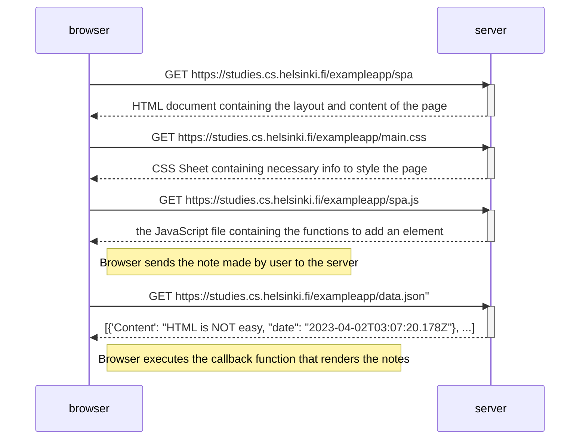

```mermaid
sequenceDiagram
    participant browser
    participant server

    browser->>server: GET https://studies.cs.helsinki.fi/exampleapp/spa
    activate server
    server-->>browser: HTML document containing the layout and content of the page
    deactivate server

    browser->>server: GET https://studies.cs.helsinki.fi/exampleapp/main.css
    activate server
    server-->>browser: CSS Sheet containing necessary info to style the page
    deactivate server

    browser->>server: GET https://studies.cs.helsinki.fi/exampleapp/spa.js
    activate server
    server-->>browser: the JavaScript file containing the functions to add an element
    deactivate server
    Note right of browser: Browser sends the note made by user to the server

    browser->>server: GET https://studies.cs.helsinki.fi/exampleapp/data.json"
    activate server
    server-->>browser: [{'Content': "HTML is NOT easy, "date": "2023-04-02T03:07:20.178Z"}, ...]
    deactivate server
    Note right of browser: Browser executes the callback function that renders the notes
```

