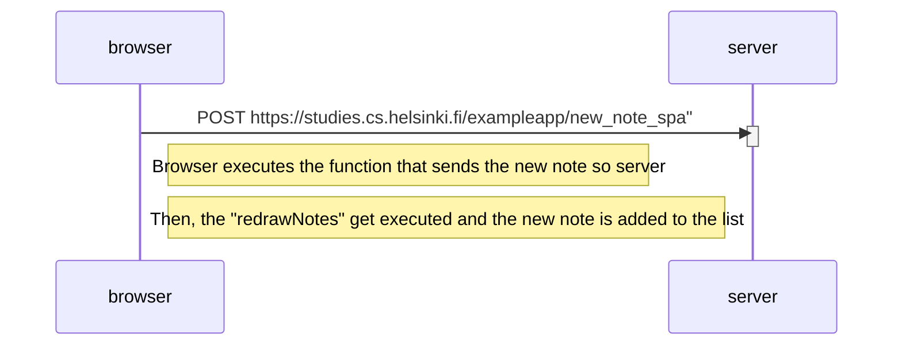

```mermaid
sequenceDiagram
    participant browser
    participant server

    browser->>server: POST https://studies.cs.helsinki.fi/exampleapp/new_note_spa"
    activate server
    deactivate server
    Note right of browser: Browser executes the function that sends the new note so server
    Note right of browser: Then, the "redrawNotes" get executed and the new note is added to the list
```
